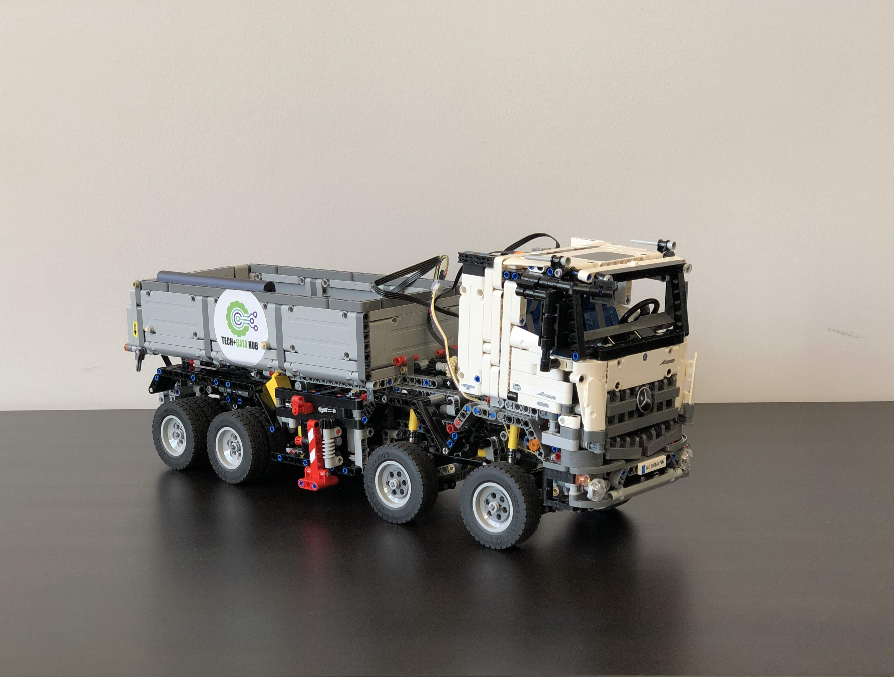

# Streaming data from a LEGO Truck 🚚

Using data streamed from our custom made LEGO Truck,
we will present several Scala-based streaming event processing technologies
such as Apache Kafka (Kafka Streams), Apache Storm
and Apache Spark (Spark Streaming).

We will show key differences and we will try to compare them in a fair manner
on aspects like performance, implementation learning curve, stability, etc.

### Project breakdown

* `docs` -> Contains demo slides. See [README.md](./docs/README.md)
* `kafka` -> Contains Kafka Streams Scala example. See [README.md](./kafka/README.md)
* `spark` -> Contains Spark Streaming Scala example. See [README.md](./spark/README.md)
* `storm` -> Contains Storm Scala example. See [README.md](./storm/README.md)

### Technologies under evaluation

* Apache Kafka (Kafka Streams)
* Apache Spark (Spark Streaming)
* Apache Storm
* [Apache Flink](https://flink.apache.org/) (not implemented)
* [Akka Streams](https://doc.akka.io/docs/akka/current/stream/index.html) (not implemented)
* [Apache Samza](http://samza.apache.org/) (not implemented)

### Presentation

[Slides on GitHub Pages](https://necosta.github.io/streaming-tech-scala-meetup/)

### Pre-requisites

* Install [SBT](https://www.scala-sbt.org/download.html)

### Disclaimer

The views, thoughts, and opinions expressed in this repository belong 
solely to the author, and not to the author’s employer, organization, 
committee or other group or individual.

### License

This project is licensed under the terms of the MIT license. See [LICENSE](LICENSE)

🚚🚍🚚🚍🚚🚍🚚🚍🚚🚍🚚🚍
